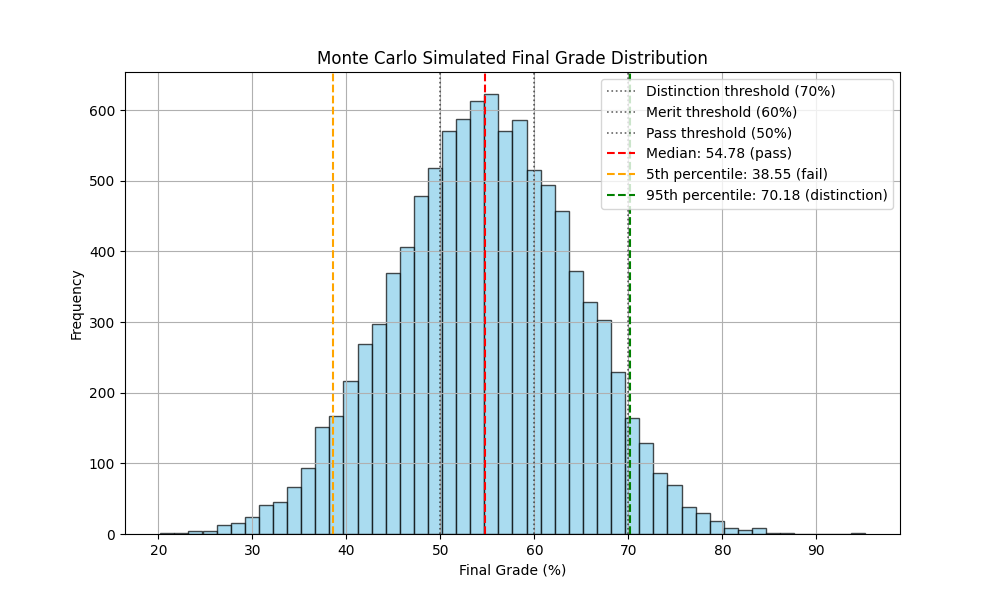

## degree-calculator

A Python-based degree award calculator with some useful (and some questionably useful) statistics.

### Usage guide

1. Install Python and clone/download this repository.
2. Create a `units.yml` file by copying the [example](degree-calculator/units.example.yml)
3. Enter information about your degree units/modules (ideally including all future ones for accurate results)
4. Optionally, add information about your degree classification thresholds for extra statistics.

### Outputs

1. **Weighted averages**  
    
    Calculates each unit's predicted grade using appropriately weighted existing assessment marks. Then, computes the weighted average across all units to provide a predicted final grade and classification.

2. **Minimum/actual grade calculation**

    Calculates the weighted final grade using only existing grades, assuming missing grades are zero.

3. **Maximum grade calculation**

    Calculates the weighted final grade and classification using existing grades, while assuming missing grades are perfect scores (100%).

4. **Probabilistic Prediction**

    Calculates variance and weighted means based on existing grades, then uses the Monte Carlo method to simulate unknown units. Provides the following statistics:

    - **Median**: Another estimate for final grade and classification.
    - **5th & 95th percentiles**: Upper and lower bounds to guage distribution of results.
    - **Simulated probabilities of classifications**: Estimated probabilities of achieving the provided classifications.
    - **Histogram**: A histogram illustrating the distribution of simulated units.
